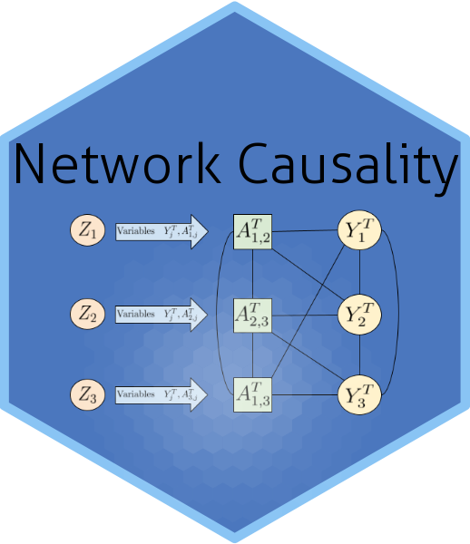

# Causal Inference over Stochastic Networks

This is the software and data used for the paper:

[Causal Inference over Stochastic Networks](https://doi.org/10.1093/jrsssa/qnae001), by Duncan A. Clark and
Mark S. Handcock.

It is to appear in the *Journal of the Royal Statistical Society*, Series A.

## Summary

Claiming causal inferences in network settings necessitates careful consideration
of the often complex dependency between outcomes for actors. Of particular importance are
treatment spillover or outcome interference effects. We consider causal inference when the
actors are connected via an underlying network structure. Our key contribution is a model for
causality when the underlying network is endogenous; where the ties between actors and the
actor covariates are statistically dependent. We develop a joint model for the relational and
covariate generating process that avoids restrictive separability and fixed network assumptions,
as these rarely hold in realistic social settings. While our framework can be used with general
models, we develop the highly expressive class of Exponential-family Random Network models
(ERNM) of which Markov Random Fields (MRF) and Exponential-family Random Graph models
(ERGM) are special cases. We present potential outcome based inference within a Bayesian
framework, and propose a modification to the exchange algorithm to allow for sampling from
ERNM posteriors. We present results of a simulation study demonstrating the validity of the
approach. Finally, we demonstrate the value of the framework in a case-study of smoking in the
context of adolescent friendship networks.

*Keywords*: Causality, Social Networks, Network models, Spillover, Contagion, Interference,
Gibbs measures

# Contents

## fitting

This contains the main code for fitting real data, the simulation study and assessing the goodness-of-fit. The main files are listed below.

### Add\_health\_fitting.R

Start with 

`fitting/Add_health_fitting.R`

First, read `ernm_notes` for isses with the modified and extended version of the `ernm` package and other useful information.

### GOF.R

This script carries out the triad census and makes the GOF plots contained in the paper

### ernm_MPLE.R

This script does ERNM Pseudo likelihood estimation

### sim_study.R

This script is the basis for the reproducible example of the sim study for the paper.
For fuller sim study see `sim_study_5.R`

## data

This contains the various data sources

## functions

This contains the R functions called by the fitting functions.

### fire.R

This is the Bayesian ERNM model fitting code

### util.R

These are utility functions called by other functions

## results

This contains R objects containing the actual results of the fits in the paper. There are mainly here to allow you to check that the code you have run is running correctly.
